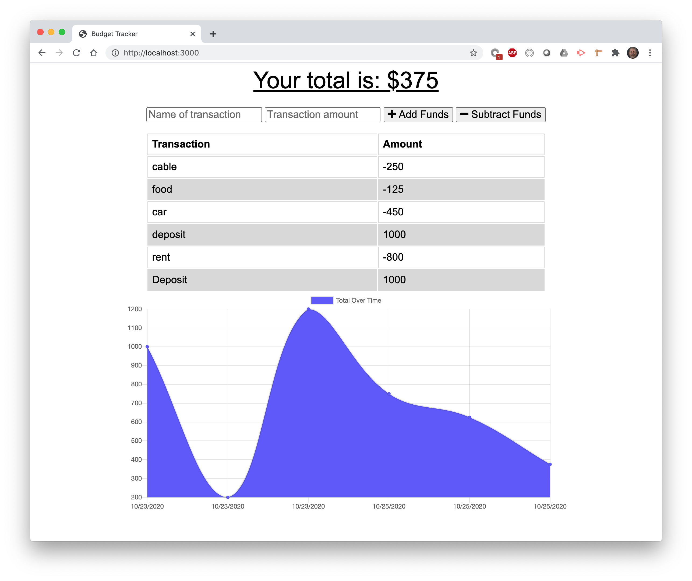

# pwa-budget-tracker
progressive web app offline homework
## Description
A PWA budget tracker app to keep track of your money even when there is no connection to the internet.

Github repo: https://github.com/macksm3/pwa-budget-tracker

Heroku live app: https://mysterious-journey-10881.herokuapp.com

## Table of Contents 

* [Installation](#installation)
* [Usage](#usage)
* [Contributers](#contributers)
* [License](#license)

## Installation
This app resides on the Heroku server and is accessed with a web browser.

## Usage
Enter each transaction with a name and amount, then click "Add Funds" or "Subtract Funds" button and the transaction will be added to the database. Transactions that are added when your system is offline will be added to database once teh system is connected to internet again. Transaction history is shown in a graph as well as a table.

## License
Apache 2.0

## Badges

